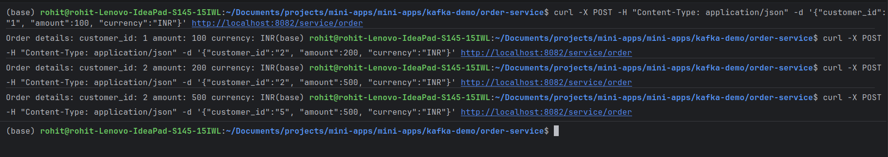
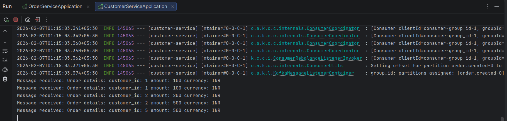

# Using Kafka with Spring boot

1. Kafka is running locally in port 9092
2. Producer(Order Service) creates messages for topic "order.created"(message content: {customer_id, amount, currency}) using POST "/service/order" with body '{"customer_id":"1", "amount":100, "currency":"INR"}'
   
3. Consumer(Customer Service) consumes and prints the messages
   